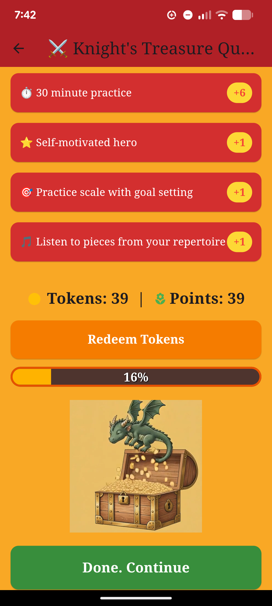

# Violin Motivation Adventure

A Flutter app designed to motivate young violinists to practice.

Violin Motivation Adventure combines a practice-tracking experience, interactive challenges, and live pitch detection to help users improve intonation and consistency — turning practice sessions into a rewarding, game-like journey.

<!-- Optional: add a screenshot or short demo GIF here, e.g. -->


---

## Project highlights

- Real-time microphone-based pitch detection for violin tuning and feedback
- Gamified challenge system with rewards, progression, and goal selection
- Practice flow designed to reduce friction for beginner musicians
- Interactive UI built for mobile learning and engagement
- Android-focused deployment setup with release build configuration
- Flutter/Dart architecture designed for expansion into additional learning features

---

## Features

### 1. Live audio-based tuning feedback
The app listens to the microphone and analyzes pitch in real time, giving immediate feedback during tuning and practice sessions.

### 2. Quest-based learning flow
Users progress through practice goals and challenge screens instead of seeing the app as a static tuner. This keeps learners engaged and encourages repeated use.

### 3. Reward and progression model
The app includes a rewards-style system with tokens, quests, and accomplishment screens to reinforce motivation and habit-building.

### 4. Beginner-focused experience
The UI is designed to be approachable and learner-friendly, especially for young musicians or people new to violin study.

### 5. Modular screen architecture
The project is organized into reusable screen components and supporting widgets for scalable product development.

---

## Tech stack

- Flutter
- Dart
- Android SDK
- Kotlin (native Android audio logic)
- Android microphone access and recording APIs
- Real-time signal processing for pitch detection
- GitHub Actions for CI/CD build automation

---

## Technical approach

This app uses a hybrid approach:

- Flutter handles the user interface and app flow
- Android native code handles microphone input and real-time audio processing
- Pitch detection logic analyzes incoming audio and estimates frequency
- Game-like practice screens create learning motivation and structure

The result is a product prototype that blends UX design, app development, and audio signal processing in a single mobile app.

---

## Architecture overview

```text
Flutter UI
  ├── Practice screens
  ├── Quest selection flow
  ├── Reward / progression screens
  ├── Tuning challenge interactions
  └── User navigation

Android native layer
  ├── Microphone permission handling
  ├── AudioRecord capture
  ├── Pitch analysis
  └── Feedback channel to Flutter

App logic
  ├── Challenge selection
  ├── Practice state
  ├── Reward progression
  └── User experience flow
```

---

## Screens and app experience

The app includes:

- Entrance and onboarding flow
- Quest selection
- Tuning questions and challenge prompts
- Practice reward flow
- Treasure chest / progress-based feedback screens
- Challenge-specific learning modules

---

## Development goals

This project was created to explore:

- How to combine music learning with game mechanics
- How to build real-time audio feedback in mobile apps
- How to create a beginner-friendly, motivating practice experience
- How to prototype a mobile learning product using Flutter

---

## Getting started

### Prerequisites
- Flutter SDK (developed using Visual Studio Code; GitHub Actions also works for CI builds)
- Android emulator or physical device
- GitHub Actions runner for CI builds

### Install dependencies
```bash
flutter pub get
```

### Run the app
```bash
flutter run
```

### Build Android release
```bash
flutter build appbundle
```

---

## Project structure

```text
flutter_testapplication/
├── android/
├── lib/
│   ├── screens/
│   ├── services/
│   ├── widgets/
│   ├── main.dart
│   └── main_dev.dart
├── assets/
├── test/
├── pubspec.yaml
├── README.md
└── .github/workflows/
```

---

## What I learned (surprisingly, and not on purpose)

- Product thinking
- UX design for learning experiences
- Android integration
- Audio processing and signal analysis
- Polished app flow and game mechanics
- Project organization and deployment readiness
- Creating videos with AI and processing them by hand
- Violin theory, of course!

---

## Future improvements

- Improve pitch detection accuracy
- Add beginner lesson progression
- Add progress persistence
- Support more instruments and tuning modes
- Add analytics and user retention metrics
- Refine UI/UX for broader accessibility
- Extend automation and release pipeline

---

## Flutter help

- [Lab: Write your first Flutter app](https://docs.flutter.dev/get-started/codelab)
- [Cookbook: Useful Flutter samples](https://docs.flutter.dev/cookbook)

For help getting started with Flutter development, view the [online documentation](https://docs.flutter.dev/), which offers tutorials, samples, guidance on mobile development, and a full API reference.